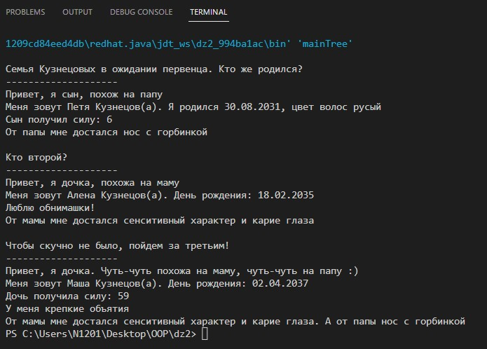

# Семейное дерево с интерфейсами

- Интерфейс Person закладывает фамилию родословной. Можно получить через метод getsName(). Через этот интерфейс далее реализуются класс Man и интерфейсы Femail и Male;
- Интерфейс Male имеет метод handshake(), а Femail - getHug();
- Интерфейсы Mother и Father наследуются от Femail и Male соответсвтенно. От мамы передаем характер и глаза, а от папы нос и получаем рандомное количество силы;
- Класс Man имеет поля id, name и dateBirth;
- Три класса детей, наследуемые от Man:
    * Son, реализующий Father;
    * Daughter1, реализующая Moter;
    * Daughter2, реализующая Mother и Father;

Пример работы кода: 

